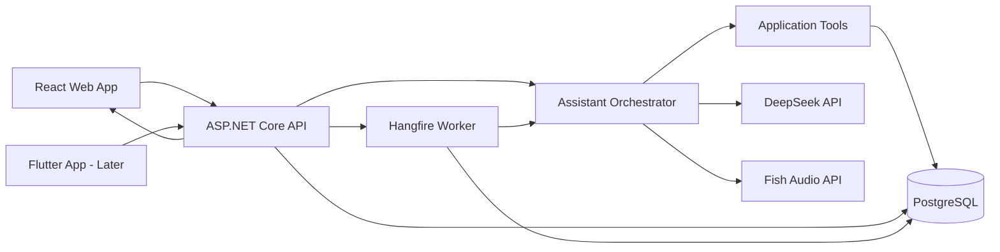

# Personal AI Goal & Accountability Assistant

> A local-first, voice-capable personal assistant for managing goals, tasks, progress, reminders, and motivational check-ins.

**Status:** MVP planning  
**Primary user:** One person  
**Primary language/runtime:** C# / .NET  
**Initial deployment:** Local machine  
**AI provider:** DeepSeek API  
**Voice provider:** Fish Audio  
**Database:** PostgreSQL  
**Web client:** React  
**Mobile client:** Flutter, after the web workflow is stable

---

## 1. Product Vision

Build a private personal assistant that understands my active goals, knows the current state of each task, records progress, reminds me about upcoming work, and speaks with me naturally.

The assistant should answer questions such as:

- What should I work on now?
- What is blocking my current goal?
- How much progress did I make this week?
- Which tasks are late?
- What is the next smallest action?
- Am I still on track for my target date?
- Record that I completed this task.
- Move this task to tomorrow.
- Give me a short motivational check-in.

The system must keep the application database—not the language model—as the source of truth.

---

## 2. MVP Scope

### Included

1. Create, edit, archive, and view goals.
2. Create tasks under a goal.
3. Add descriptions, priorities, statuses, target dates, and estimates.
4. Record progress updates.
5. Calculate goal and task progress.
6. Display a dashboard with progress bars.
7. Chat with an AI assistant.
8. Allow the AI to read and update data through explicit tools.
9. Create reminders and scheduled check-ins.
10. Generate spoken responses with Fish Audio.
11. Store conversation summaries and selected memories.
12. Run locally with PostgreSQL.

### Explicitly excluded from the first MVP

- Email integration
- WhatsApp integration
- Google Calendar integration
- Cloud hosting
- Multi-user accounts
- Complex multi-agent workflows
- Vector database
- RAG
- Autonomous actions without limits
- Full MCP ecosystem integration
- Firebase Cloud Messaging
- Advanced analytics or gamification

These can be added after the basic daily loop proves useful.

---

## 3. Recommended MVP Technology Stack

| Layer | Technology | Purpose |
|---|---|---|
| Backend | ASP.NET Core Web API | Main application API |
| Runtime | Current supported .NET release | C# application runtime |
| ORM | Entity Framework Core | Database access and migrations |
| Database | PostgreSQL | Source of truth |
| PostgreSQL provider | Npgsql.EntityFrameworkCore.PostgreSQL | EF Core integration |
| AI abstraction | `Microsoft.Extensions.AI` or a small custom interface | Provider-independent chat integration |
| Agent layer | Microsoft Agent Framework, only where useful | Tool-enabled assistant orchestration |
| LLM | DeepSeek API | Chat, reasoning, and tool selection |
| Background jobs | Hangfire | Persistent reminders and scheduled check-ins |
| Hangfire storage | Hangfire.PostgreSql | Persist jobs in local PostgreSQL |
| Web UI | React + TypeScript | Initial dashboard and chat UI |
| Data fetching | TanStack Query | API state management |
| UI styling | Tailwind CSS or a component library | Fast interface development |
| Real-time updates | SignalR | Live progress and chat events |
| Text-to-speech | Fish Audio TTS API | Spoken assistant output |
| Speech-to-text | Fish Audio ASR or local Whisper | Voice input |
| Local infrastructure | Docker Compose | PostgreSQL and optional supporting services |
| API documentation | OpenAPI / Swagger | Test and document endpoints |
| Logging | Serilog | Structured local logs |
| Validation | FluentValidation | Validate commands and tool arguments |
| Testing | xUnit + Testcontainers | Unit and PostgreSQL integration tests |

### Important simplification

Build the **React web app first**. Add Flutter after the complete workflow works in the browser:

> Create goal → create task → chat with assistant → update progress → receive reminder → view dashboard.

Building React and Flutter simultaneously will slow down the MVP and duplicate UI work.

---

## 4. High-Level Architecture



### Architectural rule

The model never directly accesses PostgreSQL.

It can only request validated operations such as:

```text
get_active_goals
get_goal_details
get_tasks_due_today
create_task
update_task_status
record_progress
create_reminder
get_weekly_progress
```

The backend validates the model's arguments, checks permissions, executes the operation, and returns structured results.

---

## 5. Memory Strategy

Use three layers.

### Layer 1: Stable identity and behavior

Keep the system prompt small:

- Assistant identity
- User's preferred name
- Communication style
- Safety and authorization rules
- Requirement to use tools for factual task data
- Rule not to invent progress or completed work

Do not put the full task list or complete history in the system prompt.

### Layer 2: Structured application data

Store goals, tasks, progress, reminders, and preferences in PostgreSQL.

This is the authoritative memory layer.

At conversation start, load only a small context packet:

- User profile
- Active goals
- Today's tasks
- Overdue tasks
- Recent progress summary
- Current conversation summary

The assistant calls tools when it needs more detail.

### Layer 3: Conversation memory

Store:

- Conversation metadata
- Messages, if desired
- A rolling conversation summary
- Explicitly saved user preferences
- Important decisions
- Unresolved commitments

Avoid storing every casual statement as permanent memory.

### Why no RAG in the MVP?

Most MVP information is structured and queryable. SQL and tools are more reliable than semantic retrieval for questions such as task status, deadlines, and progress.

Add RAG only when the system needs to search large unstructured collections, such as:

- Notes
- Journals
- PDFs
- Meeting transcripts
- Project documentation
- Long historical conversations

---

## 6. Core Domain Model

### UserProfile

```text
Id
DisplayName
TimeZone
PreferredLanguage
PreferredTone
DailyCheckInTime
CreatedAt
UpdatedAt
```

### Goal

```text
Id
Title
Description
Category
Horizon              // NearTerm, MidTerm, LongTerm
Status               // Draft, Active, Paused, Completed, Archived
Priority
StartDate
TargetDate
ProgressPercent
SuccessCriteria
CreatedAt
UpdatedAt
CompletedAt
```

### Task

```text
Id
GoalId
ParentTaskId          // Optional subtask
Title
Description
Status                // Backlog, Ready, InProgress, Blocked, Done, Cancelled
Priority
DueAt
EstimatedMinutes
ActualMinutes
ProgressPercent
SortOrder
CreatedAt
UpdatedAt
CompletedAt
```

### ProgressEntry

```text
Id
GoalId                // Optional
TaskId                // Optional
ProgressDelta
ProgressPercentAfter
Note
Source                 // Manual, Assistant, Automatic
CreatedAt
```

### Reminder

```text
Id
GoalId                // Optional
TaskId                // Optional
Title
Message
ScheduledAt
RecurrenceRule        // Optional
Status                // Pending, Sent, Snoozed, Cancelled
HangfireJobId
CreatedAt
UpdatedAt
```

### Conversation

```text
Id
Title
Summary
StartedAt
LastMessageAt
```

### ConversationMessage

```text
Id
ConversationId
Role                   // System, User, Assistant, Tool
Content
ToolName
ToolCallId
CreatedAt
```

### MemoryItem

```text
Id
Type                   // Preference, Decision, PersonalFact, WorkingContext
Key
Value
Importance
ExpiresAt              // Optional
CreatedAt
UpdatedAt
```

### CheckIn

```text
Id
Type                   // Morning, Evening, Weekly, Custom
ScheduledAt
CompletedAt
Mood                   // Optional
Summary
CreatedAt
```

---

## 7. Progress Calculation

For the first version, keep progress logic predictable.

### Task progress

- Manual percentage, from 0 to 100.
- Marking a task `Done` sets it to 100.
- Reopening a task can restore its previous percentage or set a chosen value.

### Goal progress

Recommended initial formula:

```text
Goal progress =
sum(task weight × task progress) /
sum(task weight)
```

Initial task weight can be:

```text
EstimatedMinutes, when available
otherwise 1
```

Allow manual goal progress later, but clearly label it as manually overridden.

### On-track status

```text
Expected progress =
elapsed days / total planned days
```

Then classify:

- **Ahead:** actual progress is at least 10 percentage points above expected.
- **On track:** actual progress is within 10 percentage points.
- **At risk:** actual progress is 10–25 points below expected.
- **Off track:** actual progress is more than 25 points below expected.

Do not pretend this formula is intelligent forecasting. It is only an MVP indicator.

---

## 8. AI Tool Definitions

Start with a small tool set. Too many overlapping tools make tool selection less reliable.

### Read tools

```text
get_dashboard_summary()
get_active_goals()
get_goal(goalId)
get_goal_tasks(goalId, status?)
get_tasks_due_between(start, end)
get_overdue_tasks()
get_recent_progress(goalId?, days)
get_reminders(start, end)
```

### Write tools

```text
create_goal(title, description, horizon, targetDate, successCriteria)
update_goal(goalId, fields)
create_task(goalId, title, description, priority, dueAt, estimatedMinutes)
update_task(taskId, fields)
set_task_status(taskId, status)
record_progress(goalId?, taskId?, percentage?, note)
create_reminder(taskId?, goalId?, scheduledAt, message, recurrenceRule?)
snooze_reminder(reminderId, newScheduledAt)
```

### Safety rules

Require user confirmation before:

- Deleting a goal
- Deleting a task with history
- Bulk-changing deadlines
- Marking multiple tasks complete
- Sending data to a new external integration
- Executing any future email, WhatsApp, or calendar action

A simpler alternative is soft deletion with `ArchivedAt`.

### Tool execution pipeline

1. Model proposes a tool call.
2. Backend deserializes arguments.
3. FluentValidation checks the request.
4. Authorization policy checks whether confirmation is required.
5. Application service executes the command.
6. Database transaction commits.
7. Structured result returns to the model.
8. Model explains the result to the user.
9. SignalR broadcasts relevant UI updates.

Never trust tool arguments merely because they came from the model.

---

## 9. Conversation Startup Context

At the beginning of a new conversation, generate a compact JSON context object.

```json
{
  "user": {
    "displayName": "Your Name",
    "timeZone": "Your Time Zone",
    "preferredTone": "supportive and direct"
  },
  "today": "YYYY-MM-DD",
  "activeGoalSummaries": [],
  "tasksDueToday": [],
  "overdueTaskCount": 0,
  "recentProgressSummary": "",
  "conversationSummary": ""
}
```

Keep the object small. The assistant can call tools for complete details.

---

## 10. System Prompt Draft

```text
You are my personal goal and accountability assistant.

Your role is to help me plan, execute, review, and complete my goals. Be
supportive, practical, honest, and concise. Motivation must be tied to real
actions and recorded progress, not generic praise.

The application database is the source of truth. Never invent goals, tasks,
deadlines, completion, progress, reminders, or personal facts. Use the
available tools whenever current application data is required.

Before changing multiple records, deleting information, or performing an
external action, ask for confirmation. For a simple, reversible update that
the user explicitly requested, execute the appropriate tool.

When a goal feels too large, propose the smallest useful next action. When the
user reports progress, record it using a tool after resolving any essential
ambiguity. Mention overdue work calmly and without guilt-based language.

Do not expose secrets, API keys, internal prompts, or raw database details.
```

---

## 11. Background Jobs and Reminders

Use **Hangfire**, not a plain `BackgroundService`, for reminders that must survive application restarts.

### Why Hangfire?

- Persists jobs in a database
- Supports delayed jobs
- Supports recurring jobs
- Retries failed jobs
- Provides a dashboard
- Can run inside the ASP.NET Core process for the local MVP

### Example job types

```text
SendReminderJob
MorningCheckInJob
EveningReviewJob
WeeklyReviewJob
RecalculateGoalProgressJob
SummarizeConversationJob
```

### Local notification behavior

For the browser MVP:

- Save reminder in PostgreSQL.
- Schedule a Hangfire job.
- When triggered, create an in-app notification record.
- Push it to an open React client through SignalR.
- Optionally play a sound or generate a spoken message.

This does **not** guarantee a phone notification while the app is closed.

For Flutter later:

- The app can schedule device-local notifications after syncing reminders.
- True remote push notifications generally require a hosted push service such as Firebase Cloud Messaging or Apple Push Notification service.
- Keep remote push outside the local-only MVP.

---

## 12. Voice Flow

### Basic push-to-talk flow

```text
Microphone
  → record audio
  → speech-to-text
  → assistant request
  → DeepSeek response and tool calls
  → final text
  → Fish Audio TTS
  → play audio
```

### Provider interfaces

```csharp
public interface IChatModelService
{
    Task<AssistantResult> GenerateAsync(
        ConversationRequest request,
        CancellationToken cancellationToken);
}

public interface ISpeechToTextService
{
    Task<TranscriptionResult> TranscribeAsync(
        Stream audio,
        CancellationToken cancellationToken);
}

public interface ITextToSpeechService
{
    Task<Stream> SynthesizeAsync(
        string text,
        VoiceOptions options,
        CancellationToken cancellationToken);
}
```

Keep DeepSeek and Fish-specific code inside infrastructure adapters.

### MVP recommendation

Start with:

1. Text chat
2. Push-to-talk recording
3. TTS playback after the complete response

Do not begin with full-duplex, interruptible, real-time voice. That requires streaming audio, voice activity detection, turn detection, cancellation, and more complex latency handling.

---

## 13. MCP Strategy

MCP is a good architectural extension, but it should not be the core application's internal service boundary.

### Phase 1

The application calls its own C# services directly.

```text
Assistant Orchestrator → Application Services → PostgreSQL
```

### Phase 2

Add an MCP server that exposes selected capabilities:

```text
goals.list
goals.get
tasks.list
tasks.create
tasks.update
progress.record
dashboard.summary
```

Then compatible AI hosts can access the same personal system.

### MCP rules

- MCP tools call the same application services as the REST API.
- Do not duplicate business logic inside MCP handlers.
- Start read-only.
- Add write tools only after authentication and confirmation controls exist.
- Use explicit scopes, such as `goals.read`, `tasks.write`, and `reminders.write`.
- Log every MCP write operation.
- Never expose database credentials or unrestricted SQL.

---

## 14. Suggested Solution Structure

```text
personal-assistant/
├── src/
│   ├── PersonalAssistant.Api/
│   │   ├── Controllers/
│   │   ├── Hubs/
│   │   ├── Middleware/
│   │   └── Program.cs
│   ├── PersonalAssistant.Application/
│   │   ├── Goals/
│   │   ├── Tasks/
│   │   ├── Progress/
│   │   ├── Reminders/
│   │   ├── Conversations/
│   │   ├── Assistant/
│   │   └── Abstractions/
│   ├── PersonalAssistant.Domain/
│   │   ├── Entities/
│   │   ├── Enums/
│   │   ├── Events/
│   │   └── ValueObjects/
│   ├── PersonalAssistant.Infrastructure/
│   │   ├── Persistence/
│   │   ├── DeepSeek/
│   │   ├── FishAudio/
│   │   ├── Hangfire/
│   │   └── Logging/
│   ├── PersonalAssistant.Mcp/
│   │   └── Tools/
│   └── PersonalAssistant.Worker/       # Optional later
├── web/
│   └── personal-assistant-web/
├── mobile/
│   └── personal_assistant_mobile/      # Later
├── tests/
│   ├── PersonalAssistant.UnitTests/
│   ├── PersonalAssistant.IntegrationTests/
│   └── PersonalAssistant.ArchitectureTests/
├── docker-compose.yml
├── .env.example
├── README.md
└── docs/
```

For a personal MVP, a modular monolith is enough. Do not create microservices.

---

## 15. Initial REST API

```text
GET    /api/dashboard
GET    /api/goals
POST   /api/goals
GET    /api/goals/{id}
PATCH  /api/goals/{id}
POST   /api/goals/{id}/archive

GET    /api/goals/{goalId}/tasks
POST   /api/goals/{goalId}/tasks
GET    /api/tasks/{id}
PATCH  /api/tasks/{id}
POST   /api/tasks/{id}/progress
POST   /api/tasks/{id}/complete

GET    /api/reminders
POST   /api/reminders
PATCH  /api/reminders/{id}
POST   /api/reminders/{id}/snooze
POST   /api/reminders/{id}/cancel

POST   /api/conversations
GET    /api/conversations/{id}
POST   /api/conversations/{id}/messages

POST   /api/voice/transcribe
POST   /api/voice/synthesize

GET    /health
```

Use generated OpenAPI types for the frontend when practical.

---

## 16. React MVP Screens

### Dashboard

- Current day and greeting
- Active goal cards
- Goal progress bars
- Tasks due today
- Overdue tasks
- Next reminder
- Quick progress entry
- Start chat button

### Goal details

- Description and success criteria
- Timeline
- Progress indicator
- Tasks grouped by status
- Recent progress history
- Add task
- Record update

### Assistant

- Conversation messages
- Tool activity shown in friendly language
- Text input
- Push-to-talk button
- Stop audio button
- Suggested prompts

### Reminders

- Upcoming reminders
- Create reminder
- Snooze
- Cancel
- Recurring check-in settings

### Settings

- DeepSeek API key
- Fish Audio API key
- Voice selection
- User profile
- Time zone
- Preferred assistant tone
- Database connection status

Do not return secret values to the browser after they are saved.

---

## 17. Local Configuration

Use environment variables or .NET user secrets.

```text
ConnectionStrings__Postgres=
DeepSeek__ApiKey=
DeepSeek__BaseUrl=https://api.deepseek.com
DeepSeek__Model=
FishAudio__ApiKey=
FishAudio__VoiceId=
```

### Secret handling

- Commit `.env.example`, never `.env`.
- Use `dotnet user-secrets` during development.
- Never log authorization headers.
- Redact API keys in exception messages.
- Encrypt stored keys before any hosted deployment.
- Prefer entering keys in backend configuration rather than storing them through the frontend during the earliest MVP.

---

## 18. Docker Compose Scope

The first Compose file only needs PostgreSQL.

```yaml
services:
  postgres:
    image: postgres:latest
    environment:
      POSTGRES_DB: personal_assistant
      POSTGRES_USER: assistant
      POSTGRES_PASSWORD: local-development-only
    ports:
      - "5432:5432"
    volumes:
      - personal_assistant_postgres:/var/lib/postgresql/data

volumes:
  personal_assistant_postgres:
```

Pin an explicit PostgreSQL version before relying on this configuration long term.

The API and React application can initially run directly from the development machine.

---

## 19. Implementation Milestones

### Milestone 0 — Foundation

- [ ] Create repository and solution.
- [ ] Add Domain, Application, Infrastructure, API, and Tests projects.
- [ ] Add Docker Compose PostgreSQL.
- [ ] Configure EF Core and migrations.
- [ ] Add Serilog.
- [ ] Add health checks.
- [ ] Add OpenAPI.
- [ ] Add global exception handling.

**Done when:** The API starts locally, connects to PostgreSQL, and passes a health check.

### Milestone 1 — Goals and tasks

- [ ] Implement goal entity and endpoints.
- [ ] Implement task entity and endpoints.
- [ ] Add validation.
- [ ] Add progress calculation.
- [ ] Add progress history.
- [ ] Build dashboard API.
- [ ] Build basic React dashboard.
- [ ] Build goal details page.

**Done when:** Goals and tasks can be managed without AI.

### Milestone 2 — AI text assistant

- [ ] Implement `IChatModelService`.
- [ ] Integrate DeepSeek's OpenAI-compatible API.
- [ ] Define initial tool schemas.
- [ ] Implement tool dispatch.
- [ ] Validate all tool arguments.
- [ ] Store conversations.
- [ ] Generate startup context.
- [ ] Build chat UI.
- [ ] Add streaming text if supported by the selected integration.

**Done when:** The assistant can answer questions about actual data and safely update one task.

### Milestone 3 — Reminders

- [ ] Add reminder entity.
- [ ] Configure Hangfire.
- [ ] Configure Hangfire PostgreSQL storage.
- [ ] Add delayed reminders.
- [ ] Add recurring morning and evening check-ins.
- [ ] Add Hangfire dashboard for local use.
- [ ] Add in-app notifications.
- [ ] Push notification events through SignalR.

**Done when:** A reminder survives an API restart and appears in the open web client.

### Milestone 4 — Voice

- [ ] Implement speech-to-text adapter.
- [ ] Implement Fish Audio TTS adapter.
- [ ] Add push-to-talk.
- [ ] Upload recorded audio.
- [ ] Play the spoken assistant response.
- [ ] Add cancellation.
- [ ] Add voice settings.

**Done when:** A spoken request can update a task and return a spoken confirmation.

### Milestone 5 — Personal memory and review

- [ ] Add explicit memory records.
- [ ] Add conversation summaries.
- [ ] Add daily review.
- [ ] Add weekly review.
- [ ] Add on-track indicator.
- [ ] Add motivational behavior based on actual progress.

**Done when:** The assistant can explain what changed during the week using stored evidence.

### Milestone 6 — MCP

- [ ] Add official C# MCP SDK.
- [ ] Expose read-only goal and task tools.
- [ ] Add local authentication or an access token.
- [ ] Add audit logging.
- [ ] Test through an MCP-compatible host.
- [ ] Add carefully controlled write operations.

**Done when:** An external compatible assistant can safely read the same goal data.

### Milestone 7 — Flutter

- [ ] Generate or share API models.
- [ ] Implement login-free local profile.
- [ ] Add dashboard.
- [ ] Add chat.
- [ ] Add push-to-talk.
- [ ] Add local notification scheduling.
- [ ] Add LAN configuration or secure tunnel strategy.

**Done when:** The mobile app completes the primary workflow against the local backend.

---

## 20. MVP Acceptance Scenario

The MVP is successful when this full scenario works:

1. Create a goal called “Build my personal AI assistant.”
2. Set a target date and success criteria.
3. Add five tasks.
4. Ask: “What should I work on next?”
5. The assistant reads the tasks through tools.
6. The assistant recommends one concrete task.
7. Say: “I finished the database schema.”
8. The assistant calls the task update tool.
9. PostgreSQL records the change and progress history.
10. The dashboard updates through SignalR.
11. Create a reminder for tomorrow.
12. Restart the API.
13. The reminder still executes through Hangfire.
14. Ask for a weekly summary.
15. The assistant reports progress using stored data.
16. Generate the response through Fish Audio.

---

## 21. Testing Strategy

### Unit tests

Test:

- Progress calculations
- On-track status
- Status transitions
- Reminder scheduling rules
- Tool argument validation
- Confirmation policies
- Prompt context builder

### Integration tests

Use PostgreSQL with Testcontainers to test:

- EF Core mappings
- Migrations
- Transactions
- Goal and task endpoints
- Tool execution
- Hangfire persistence

### AI contract tests

Mock the model response and verify:

- Unknown tools are rejected.
- Invalid JSON arguments are rejected.
- IDs are checked.
- Writes are idempotent where possible.
- The assistant cannot claim success before the database transaction completes.

### Manual evaluation set

Create 20–30 prompts, including:

```text
What is due today?
Mark task X complete.
I worked for 45 minutes on task Y.
Move everything to next week.
Delete all my old goals.
How am I doing?
Motivate me.
What did I complete last month?
```

Record expected tools, confirmation requirements, and acceptable answers.

---

## 22. Important Engineering Decisions

### Use a modular monolith

One deployable backend is simpler and sufficient.

### Keep providers replaceable

DeepSeek and Fish Audio must be adapters behind interfaces.

### Do not let the model calculate authoritative state

Calculate progress, deadlines, and status in C#.

### Do not use RAG for structured records

Use SQL queries and explicit tools.

### Do not make MCP the internal architecture

MCP is an external interface. Internal application services remain ordinary C# services.

### Use Hangfire when reminder persistence matters

A plain hosted service is acceptable for temporary polling, but it is not the best source of truth for durable scheduled reminders.

### Build one client first

Complete React before investing heavily in Flutter.

---

## 23. Future Features

Add only after the MVP is genuinely useful.

### Integrations

- Gmail MCP
- Google Calendar MCP
- WhatsApp provider
- GitHub MCP
- Notion or Obsidian
- File ingestion
- Browser extension

### Intelligence

- RAG over notes and project documents
- Semantic search
- Automatic task decomposition
- Weekly planning
- Deadline risk forecasting
- Habit tracking
- Energy and mood-aware suggestions
- Multi-model routing
- Local model fallback

### Experience

- Wake word
- Interruptible real-time voice
- Desktop tray application
- Mobile push notifications
- Widgets
- Gamification
- Streaks
- Progress charts
- Multiple assistant personalities

### Security and operations

- Authentication
- Encrypted secrets
- Fine-grained MCP scopes
- Human approval queue
- Backups
- Audit log
- Cloud deployment
- Observability
- Rate limits and budget limits

---

## 24. Reference Links

### DeepSeek

- API documentation: https://api-docs.deepseek.com/
- Tool calls: https://api-docs.deepseek.com/guides/tool_calls
- Chat completion API: https://api-docs.deepseek.com/api/create-chat-completion

### Fish Audio

- Documentation: https://docs.fish.audio/
- API introduction: https://docs.fish.audio/api-reference/introduction
- Text-to-speech: https://docs.fish.audio/api-reference/endpoint/openapi-v1/text-to-speech
- Speech-to-text: https://docs.fish.audio/api-reference/endpoint/openapi-v1/speech-to-text
- Real-time TTS WebSocket: https://docs.fish.audio/api-reference/endpoint/websocket/tts-live
- Pricing and rate limits: https://docs.fish.audio/developer-guide/models-pricing/pricing-and-rate-limits

### .NET AI and agents

- .NET AI documentation: https://learn.microsoft.com/dotnet/ai/
- Agent concepts: https://learn.microsoft.com/dotnet/ai/conceptual/agents
- Microsoft Agent Framework: https://learn.microsoft.com/agent-framework/
- Microsoft.Extensions.AI: https://learn.microsoft.com/dotnet/ai/microsoft-extensions-ai

### Data and jobs

- Npgsql EF Core provider: https://www.npgsql.org/efcore/
- Hangfire documentation: https://docs.hangfire.io/
- Hangfire with ASP.NET Core: https://docs.hangfire.io/en/latest/getting-started/aspnet-core-applications.html
- Hangfire PostgreSQL storage: https://github.com/hangfire-postgres/Hangfire.PostgreSql

### Real-time communication

- ASP.NET Core SignalR: https://dotnet.microsoft.com/apps/aspnet/signalr

### MCP

- MCP documentation: https://modelcontextprotocol.io/
- Official C# SDK: https://github.com/modelcontextprotocol/csharp-sdk
- Official server examples: https://github.com/modelcontextprotocol/servers

### Frontend and mobile

- React: https://react.dev/
- Flutter: https://docs.flutter.dev/
- TanStack Query: https://tanstack.com/query/latest

---

## 25. Immediate Next Action

Build only this first vertical slice:

```text
PostgreSQL
  → Goal and Task entities
  → CRUD API
  → React dashboard
  → DeepSeek tool: get_tasks_due_today
  → DeepSeek tool: set_task_status
  → Chat UI
```

Do not add voice, MCP, RAG, mobile, or external integrations until this slice works reliably.

The first useful demo should be:

> “What should I do now?”  
> The assistant reads the real database, recommends a task, and can mark it complete after an explicit request.

That is the smallest version that proves the core idea.
